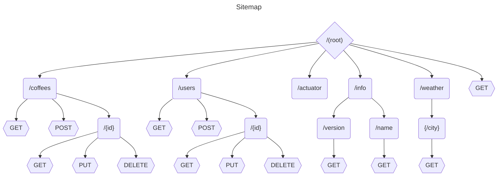

### Sample Spring project using REST API

Currently running on https://spring.nixiedroid.com

### SiteMap 

```mermaid
---
title: Sitemap
---

flowchart TB
root{"/(root)"} --> cof(/coffees)
root --> usr(/users)
root --> act(/actuator)
root --> inf(/info)
root --> wtr(/weather)
root --> GETroot{{GET}}

cof --> GETcof{{GET}}
cof --> POSTcof{{POST}}
cof --> cofID("/{id}")

cofID --> GETcofID{{GET}}
cofID --> PUTcofID{{PUT}}
cofID --> DELETEcofID{{DELETE}}

usr --> GETusr{{GET}}
usr --> POSTusr{{POST}}
usr --> usrID("/{id}")

usrID --> GETusrID{{GET}}
usrID --> PUTusrID{{PUT}}
usrID --> DELETEusrID{{DELETE}}

inf --> infVer("/version") --> GETinfVer{{GET}}
inf --> infName("/name") --> GETinfName{{GET}}

wtr --> city("{/city}")
city --> GETcity{{GET}}
```
    
### Notes
see [MAP](notes/MAP.md)