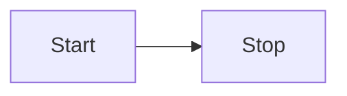

### Sample Spring project using REST API

Currently running on https://spring.nixiedroid.com

### SiteMap 

- `/coffees`
    - **GET**: get list of coffees
    - **POST**: add coffee
    - `/{id}`
        - **GET**: get coffee by `{id}`
        - **PUT**: update or create coffee by `{id}`
        - **DELETE**: delete coffee by `{id}`
- `/actuator`
    - `/health`
        - **GET**
    - `/info`
      - **GET**
    - `/env`
      - **GET**
    - `/mappings`
        - **GET**
    
### Notes
see [MAP](notes/MAP.md)